 

  

&nbsp;&nbsp;

---

## `~/` THE FORGE

| | Project | What it does |
|---|---|---|
| `01` | **ThinkForge** `private` | AI development control plane for running, routing, and verifying coding agents. |
| `02` | **[EchoForge](https://github.com/QuickkNastyy/EchoForge)** | Real-time speech translation built for fast capture, translation, and local control. |
| `03` | **LeadForge** `private` | Captures inbound website leads and routes them into usable business workflows. |
| `04` | **JobBot** `private` | Autonomous job-application agent. Reads postings, fills ATS forms, records every run. |
| `05` | **DSH** `private` | Multi-environment execution and verification layer for AI-assisted development. |

Repos marked <code>private</code> are still being built. Links go up as they open.

---

## `~/` THE TOOLBOX

**Where I actually live:** TypeScript · Electron · Playwright · Node · Python
**What I reach for next:** Postgres · Docker · GitHub Actions

---

---

## `~/` THE NUMBERS

 

---

<code>// probably vibe coding some shit</code>

