 

  

---

## `~/` THE FORGE

| | Project | What it does |
|---|---|---|
| `01` | **ThinkForge** | AI development control plane for running, routing, and verifying coding agents. |
| `02` | **[EchoForge](https://github.com/QuickkNastyy/EchoForge)** | Real-time speech translation built for fast capture, translation, and local control. |
| `03` | **LeadForge** | Captures inbound website leads and routes them into usable business workflows. |
| `04` | **JobBot** | Autonomous job-application agent. Reads postings, fills ATS forms, records every run. |
| `05` | **DSH** | Multi-environment execution and verification layer for AI-assisted development. |

Most of the Forge is private while it's being built. Links go up as they open.

---

## `~/` THE TOOLBOX

**Where I actually live:** TypeScript · Electron · Playwright · Node · Python
**What I reach for next:** Postgres · Docker · GitHub Actions

---

<!-- THE NUMBERS - switched off until the contribution graph finishes
     reindexing and a few more repos are public. Delete this line and
     the closing marker further down to turn the cards on. -->
<!--

## `~/` THE NUMBERS

 

---
-->

<b><code>~/</code> RULES OF THE FORGE</b>

 

- if it repeats, automate it
- if it fails, record it
- if it ships, test it
- if it hurts twice, build a tool

<b><code>~/</code> CURRENTLY</b>

 

- Hardening **JobBot** — flight recorder, loop guards, Workday recovery
- Building out the rest of the Forge line
- Gaming, allegedly full-time

 

 
<code>// probably vibe coding some shit</code>

